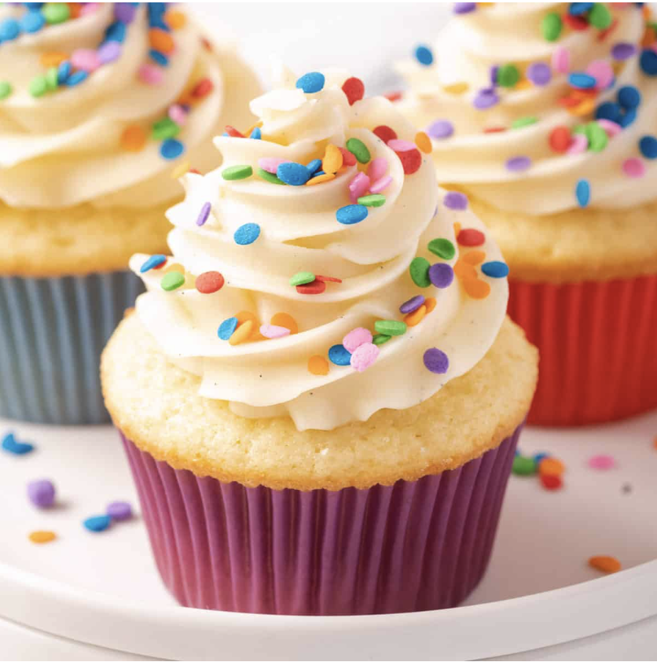

# Vanilla Cupcakes

Vanilla cupcakes are small, sweet cakes baked in individual paper liners, featuring a soft, fluffy crumb and a warm, sweet vanilla flavor!

### Ingredients: 
- Butter
- Vanilla
- Baking Powder
- Oil
- Milk
- Flour
- Sugar
- Salt

### Instructions: 
1. Use a handheld beater
2. Whip the eggs and sugar
3. Whisk together
4. Gradually add the flour mixture into the egg mixture in 3 lots, mixing for just 5 seconds on Speed 1 in between
5. Melt butter and heat milk
6. Mix some batter into hot milk (tempering)
7. Slowly pour milk mixture back into whipped eggs
8. Fill cupcake liners
9. Bake for 22 minutes
10. ENJOY!!!

[Link to the original recipe](https://www.recipetineats.com/vanilla-cupcakes/)
