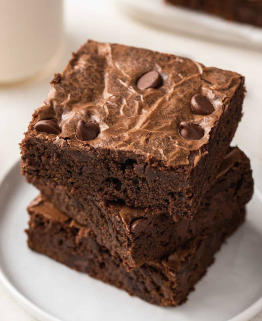

# Homemade Brownies

A brownie is a small, square-shaped baked chocolate dessert bar with a dense and rich texture

### Ingredients: 
- 2 eggs + water
- Powdered sugar
- Unsweetened cocoa powder
- Oil
- Vanilla Extract

### Instructions: 
1. First, mix together the dry and wet ingredients in two separate bowls.
2. Next, combine the wet and dry ingredients.
3. Then, pour the batter into an 8x8 inch baking pan lined with parchment paper. 
4. Finally, bake!

[Link to original recipe](https://www.loveandlemons.com/brownies-recipe/)