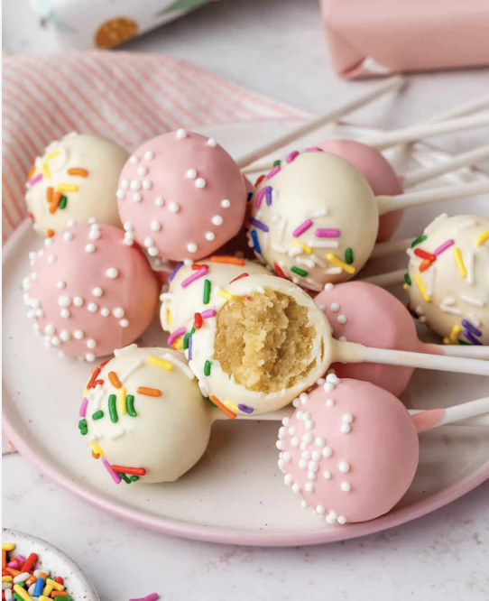

# CakePops

Learn how to make homemade cake pops completely from scratch, with no box cake mix or canned frosting. Combine homemade vanilla cake and vanilla buttercream and dip in white chocolate for a sweet treat kids (and adults, too!) always go crazy for. Watch the video tutorial for all my best shaping tips!

## Ingredients:
1. 1 and 2/3 cups (209g) all-purpose flour
2. 1/2 teaspoon baking powder
3. 1/4 teaspoon baking soda
4. 1/2 teaspoon salt
5. 1/2 cup (8 Tbsp; 113g) unsalted butter
6. 1 cup (200g) granulated sugar
7. 1 large egg, at room temperature
8. 1 large egg, at room temperature
9. 1 cup (240ml) whole milk (or buttermilk)

### Frosting:
1. 7 Tablespoons (99g) unsalted butter
2. 1 and 3/4 cups (210g) confectioners sugar
3. 2 or 3 teaspoons heavy cream or whole milk
4. 1 teaspoon pure vanilla extract

### Coating:
1. 24 ounces (678g) candy melts (or white chocolate bars)
Sprinkles!

## Instructions:
1. Preheat oven to 350°F (177°C). Grease a 9-inch springform pan
2. Make a 1-layer vanilla cake and let cool.
3. Make vanilla buttercream frosting.
4. Crumble cake into frosting and mix.
5. Roll the mixture into balls.
6. Dip in melted chocolate.
7. Top with sprinkles and let dry.
8. EAT!

### Notes:
- Make Ahead Instructions: I always make the cake 1 day ahead of time. Cover and keep at room temperature. You can store the undipped cake balls in the refrigerator for up to 2 days or freeze them for up to 6 weeks.
- Coating: You can use candy coating/candy melts, or chopped white chocolate. I typically use Ghirardelli brand white chocolate melting wafers. Semi-sweet, bittersweet, or milk chocolate baking bars work, too. Coarsely chop the chocolate and place it in a microwave-safe bowl or glass liquid measuring cup, along with 1/2 teaspoon vegetable oil to help thin it out. Microwave in 20-second increments, stirring after each 20 seconds, until melted and smooth. Keep warm over a double boiler.

[Link to original recipe!](https://sallysbakingaddiction.com/homemade-cake-pops/)
